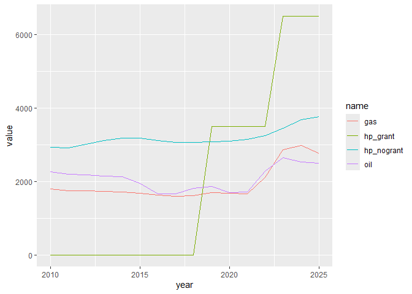
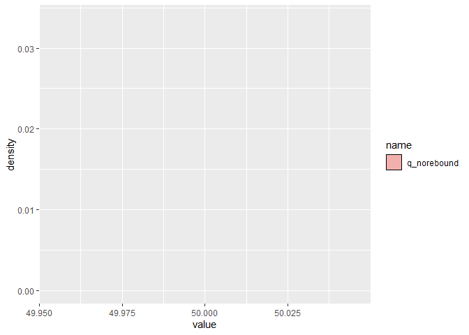

<!-- README.md is generated from README.Rmd. Please edit that file -->

# hpmicrosimr

<!-- badges: start -->

[](https://github.com/Phalacrocorax-gaimardi/hpmicrosimr/actions/workflows/R-CMD-check.yaml)
<!-- badges: end -->

*hpmicrosimr* is an agent-based model simulation framework describing
home energy efficiency and heating technology system upgrades by
$\approx 800$ Irish owner-occupier households. Typically the model is
initialised in 2015 and is run to 2040 or 2050. Agent characteristics
are based on survey data collected in 2024.

This is the development, but fully working, version of *hpmicrosimr*.
The main functionality is (1) a detailed model of financial return on
household energy investments including choice of heating technology (2)
an initialiser, (3) an **updater** and (4) runABM. Agents live on a
artificial social network to allow peer effects in heat pump adoption to
be described.

The heating systems included in the current version of *hpmicrosimr* are
oil, solid_fuel, gas, electric and air source heat_pumps. There are two
underlying space heating upgrade processes describe by *hpmicrosimr* at
each time step. The most common event is failure and replacement of the
current heating system.Failure probability is described by a Weibull
distribution with technology-specific factors. The current version of
*hpmicrosimr* assumes that the full heating requirement is supplied by
the primary heating source. Backup secondary and tertiary heat sources
do not play a role in the modelling. Agents choose between replacing the
current fuel source with the same tech or adopting a heat pump. Risk
aversion and “status quo bias” lowers the rate of adoption of heat pumps
even in cases where this offers a better financial return. Possibilities
such as oil $`\rightarrow`$ gas are excluded as this is not an option
for households not near the gas network.

A more significant, event from the point of view of
energy efficiency is the decision by a household to carry out a deep home
energy efficiency retrofit (DER). The rate at which households take this
option is set by a parameter *p.* fit from calibration to historical
data. The household investment decision involves a choice of $HLI$
upgrade from $HLI_{old} \rightarrow HLI_{new}$, as well as a potential
technology change from $tech_{old} \rightarrow tech_{new}$. The
household may also choose to retain their current heating system. This
choice may be advantageous if the expected residual value of the
existing asset is high. A function **optimise_upgrade()** determines the
optimum upgrade choice, including the effect of any currently applicable
grants.

Applications of *hpmicrosimr* are to project energy efficiency outcomes
based on future policy scenarios (such as WEM/WAM), impacts on CO2
emissions, and associated cost-benefit analysis of generous incentive
schemes.

There are large behavioural preferences that influence energy efficiency
outcomes. There is compelling evidence from the literature of “temperature
take-back” or rebound effects following space heating efficiency
upgrades. *hpmicrosimr* includes a homogeneous rebound parameter $\rho$ to describe this effect. No rebound corresponds to $\rho=0$.

Many home energy retrofits can be expensive and are likely to to suppressed by present bias $

A separate package *hpmicrocalibrater* is used to generate the model
weights and thresholds and are provided in a dataset *agents_init*
attached to *hpmicrosimr*.

## Installation

To install the latest development version of *hpmicrosimr*:

``` r
remotes::install_github("https://github.com/Phalacrocorax-gaimardi/hpmicrosimr")
```

## Financial Returns

Householders face a complex decision when considering home energy
upgrades. *hpmicrosimr* has a number of functions that determine the
financially optimum upgrade, taking grantsinto account. The financial
return must be sufficient to overcome any behavioural correction factors
such as risk aversion, hassle, present bias, likely rebound etc before
adoption occurs.

First load in the technical and cost scenario parameters for 2026
*params*. A set of technology specific cost parameters are contained in
*tech_parms* and are assumed to be fixed (apart from skilled labour
cost).

``` r
library(hpmicrosimr)
params <- scenario_params(sD,2026)
tech_params <- tech_params_fun()
#optimise_upgrade(ber_old=180,tech_old = "oil",house_type="detached",2003,region="Munster",floor_area=100,params, is_fuel_allowance=FALSE)
```

The optimum upgrade in this case is to a B1 with a switch to a Heat
Pump. However, replacing their oil boiler is a close second. Note that
this calculation assumes no change in the heating comfort level demanded
by households. This assuming is relaxed during the calibration stage
when behavioural parameters are introduced.

### efficiency retrofit cost model

The default cost model for energy efficiency improvements used by
*hpmicrosimr* does not consider specific measures such as lift
insulation, new windows etc. Instead it is based on a marginal cost
model $`\frac{k_0}{BER^{\alpha}}`$. This reflects the steep increase in
that upgrade costs required to reach the most efficient ratings A2 etc.
The resulting efficiency upgrade matrix is shown below.

``` r
library(hpmicrosimr)
params <- scenario_params(sD,2025)
#hpmicrosimr::gen_upgrade_cost_matrix(house_type="semi_detached","Dublin",120,include_grant = FALSE,params,model="marginal")
#optimise_upgrade(ber_old=180,tech_old = "oil",house_type="detached",2003,region="Munster",floor_area=100,params, is_fuel_allowance=FALSE)
hpmicrosimr::retrofit_cost_model_logistic(4,2,"semi_detached",2,"Dublin",120,scenario_params(sD,2026))
#> [1] 37058.93
```

### Heating system capital and operating costs

Capital costs for each technology depend on the time of installation,
the system capacity (kW), whether the system replaces an earlier system
of the same fuel type, etc. For example, the influence of grants is
shown in the example below.

``` r
library(hpmicrosimr)
params <- scenario_params(sD,2026)
tech_params <- tech_params_fun()
#18kW output heat pump cost before grant
heating_system_capital_cost("heat_pump",kW=18,installation_type="new",house_type="detached",construction_year=2000,grant_type="None",params)
#> $cost
#> [1] 21580
#> 
#> $grant
#> [1] 0
#> 
#> $cost_after_grant
#> [1] 21580
#effect of grants
heating_system_capital_cost("heat_pump",18,"new","detached",2000,"BetterEnergyHomes",params)
#> $cost
#> [1] 21580
#> 
#> $grant
#> [1] 6500
#> 
#> $cost_after_grant
#> [1] 15080
```

Annual operating costs are sensitive to BER which determines the heat
requirement of the property. These depend on the current time
params\$yeartime but also the installation time of the system. This is
because efficiency has changed significantly in the past e.g. with the
introduction of condensing boilers.

``` r
library(hpmicrosimr)
params <- scenario_params(sD,2026)
tech_params <- tech_params_fun()
#C3 rating
heating_system_operating_cost(hli=4,tech="oil",installation_time=2003,floor_area=100,params,include_rebound=FALSE)
#> [1] 4296.048
#B1 rating
heating_system_operating_cost(hli=2.4,tech="oil",installation_time=2003,floor_area=100,params,include_rebound=FALSE)
#> [1] 2637.629
```

The notional operating costs calculated above assume standard heating
season conditions and a fully heated property (*include_rebound=FALSE*).
Operating costs calculated when households trade comfort for cost should
be calculated using *include_rebound=TRUE*. Assuming a large rebound of
50% ( *params\$r.*):

``` r
library(hpmicrosimr)
params <- scenario_params(sD,2026)
tech_params <- tech_params_fun()
#C3 rating
heating_system_operating_cost(hli=4,tech="oil",installation_time=2003,floor_area=100,params,include_rebound=TRUE)
#> [1] 3055.184
#B2 rating
heating_system_operating_cost(hli=2.4,tech="oil",installation_time=2003,floor_area=100,params,include_rebound=TRUE)
#> [1] 1894.29
```

### Effective Annual Costs

A key concept for the modelling is Effective Annual Cost (EAC). The EAC
represent the annual “bill”. This includes the actual heating bill as
well as the annualised capital cost of heating technology and any
efficiency upgrade undertaken. For example, a heat pump is adopted if
the EAC gain relative to a competing technology such as gas is
sufficient. This is a complex calculation because the optimal BER
upgrade for gas and heat pumps may differ. For real technologies with
uncertain lifetimes, EAC declines as the lifetime of the system is
approached. *hpmicrosimr* calculates EAC and expected system lifetimes
using technology-specific Weibull hazard functions.

Effective annual costs (EACs) of heating technologies have changed over
time due higher installation (labour) costs, efficiency gains, fuel cost
changes ad grants. To illustrate this, early year EACs for heat pump,
gas and oil systems installed during 2010-2025 is shown below, using the
*hpmicrosimr::annualised_heating_system_cost()*. The property has BER of
175kWh/m2/year in this example. The impact of the introduction of
capital grants in 2018 for heat pumps is obvious. This calculation
suggests that heat pumps are the lowest cost for this C1/C2 rated
household but this assumes that a substantial use of night-rated
electricity. The rebound effect is not included. Rebound lowers the
operating cost and therefore makes heat pumps appear less attractive.

    #> Warning: package 'ggplot2' was built under R version 4.4.3
    #> ── Attaching core tidyverse packages ──────────────────────── tidyverse 2.0.0 ──
    #> ✔ dplyr     1.1.4     ✔ readr     2.1.5
    #> ✔ forcats   1.0.0     ✔ stringr   1.5.1
    #> ✔ ggplot2   4.0.1     ✔ tibble    3.2.1
    #> ✔ lubridate 1.9.3     ✔ tidyr     1.3.1
    #> ✔ purrr     1.0.2     
    #> ── Conflicts ────────────────────────────────────────── tidyverse_conflicts() ──
    #> ✖ dplyr::filter() masks stats::filter()
    #> ✖ dplyr::lag()    masks stats::lag()
    #> ℹ Use the conflicted package (<http://conflicted.r-lib.org/>) to force all conflicts to become errors

<div class="figure">


<p class="caption">

Equivalent annual cost
</p>

</div>

### optimum upgrade

Familiarity with three high-level functions needed to run *hpmicrosimr*:
the initialiser *initial_agents()*, the updater *update_agents()* and
*run_abm()*.

## Initialiser

The function *initialise_agents()* generates an initial state of the
population of agents at a specific time.

This function does quite a bit of work behind the scenes. It is based on
2024 survey data, projected backwards to, say, 2015. It imputes missing
values of BER, construction year and household income, for example. It
also imputes the floor area of the property. If the initialisation time
of the ABM is set to 2015, then only houses constructed before 2015 are
included. This gives a full decade for model calibration, but at the
cost of a reduced sample size. Note that houses built after 2015 are not
eligible for energy efficiency grants, apart from solar PV.

If the installation year of the current heating system stated in the
survey is later then 2015 then an installation date before 2015 is
inferred for the earlier system. It is assumed that the heating
technology used by the household in 2015 is the same as the technology
used in 2024. The only exception is for heat pumps where it is assumed
that heat pumps adopted after 2015 replaced an earlier gas or oil
system. *initialise_agents()* also does a number of other recodings of
the survey variables. The complete set of survey questions and responses
are provided in the datasets *hpmicrosimr::hp_questions* and
*hpmicrosimr::hp_qanda*.

The initial state contains all data needed to evaluate EACs for each
agent for all possible technology choices. It uses the survey input data
for owner-occupiers *hp_survey_oo*. *initialise_agents()* imputes
missing values of BER ratings (based on modelling of the SEAI BER
dataset), household income etc. It also imputes the total floor area of
the property statistically based on number of bedrooms, region,
area_type etc. A new initial state is generated for each ABM run
(randomisation). This ensures that the results do not depend on a
particular values of statistically imputed variables.

## Example: initial state rebound effect

The example below illustrates the use of *initialise_agents*. The
initial annual heating requirements for each household is calculated.
The figure shows the resulting distribution of a kWh/year values with
and without rebound of 30%.

``` r
library(hpmicrosimr)
library(ggplot2)
params <- scenario_params(sD,2015)
agents_in <- initialise_agents(sD,2015, cal_run=sample(1:100,1))
#> Joining with `by = join_by(q6)`
#> Joining with `by = join_by(qc2)`
#> Joining with `by = join_by(q1)`
#> Joining with `by = join_by(serial)`
#> Joining with `by = join_by(qh)`
heat <- agents_in %>% dplyr::rowwise() %>% dplyr::mutate(q_norebound=space_heating_requirement(hli,floor_area,rebound=1,params))
heat <- heat %>% dplyr::rowwise() %>% dplyr::mutate(q_rebound=space_heating_requirement(ber,floor_area,rebound=0.3,params))
heat <- heat %>% dplyr::select(serial,q_norebound,q_rebound) %>% tidyr::pivot_longer(cols=-serial)
heat %>% dplyr::filter(value < 1e+5) %>% ggplot(aes(value,fill=name))+geom_density(alpha=0.5) #+ facet_wrap(.~name)
```



In the above example, 792 households is equivalent to initial
theoretical heating requirement of 19.5 TWh with 30% rebound for Ireland
as a whole. Without rebound it is equivalent to $`\approx`$ 26 TWh.

The heating requirements or Final Energy Consumption (FEC) will change
as the ABM runs and agents make upgrade choices. The FEC is not very
sensitive to the heating technology choices by the agents. On the other
hand, CO2 emissions are sensitive to technology choices.

## Example: Updater

*update_agents* is the core function that advances the system by one
time step

``` r
library(hpmicrosimr)
help("update_agents")
#> starting httpd help server ... done
```
