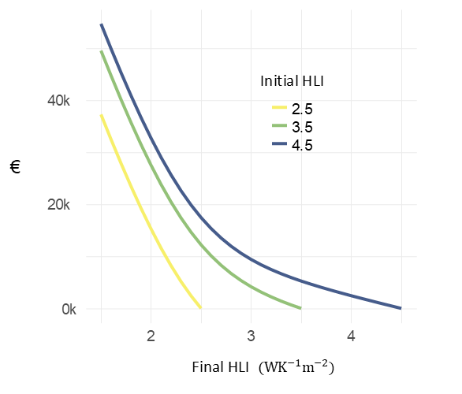

<div class="logo-readme">


</div>

<style>
.logo-readme img {
  height: 120px;
  width: auto;
  float: right;
}
</style>

<!-- README.md is generated from README.Rmd. Please edit that file -->

# hpmicrosimr

<!-- badges: start -->

[](https://github.com/Phalacrocorax-gaimardi/hpmicrosimr/actions/workflows/R-CMD-check.yaml)
[](https://opensource.org/licenses/Apache-2.0)
[](https://creativecommons.org/licenses/by/4.0/)
[](https://www.tidyverse.org/)
[](https://cran.r-project.org/web/views/HighPerformanceComputing.html)
<!-- badges: end -->

*hpmicrosimr* is an agent-based modelling framework for residential
energy efficiency upgrades. It projects space heating technology system
choices by $`\approx 800`$ Irish owner-occupier households or “agents”.
Agent characteristics are based on survey data collected in late 2024.
The model runs at bi-monthly time-steps over the intervals 2015-2040 or
2015-2040. *hpmicrosimr* therefore describes retrofit activity in the
pre-2015 Irish housing stock (about 1.16M households).

This is a development, but fully working, version of *hpmicrosimr*. The
main elements are (1) a detailed financial model for household energy
investments including heating technology, building fabric upgrade and
state grant supports (2) an **initialiser** that imputes missing data
and involves randomisation, (3) an **updater** and (4) a run module
**runABM** where a choice scenario is specified. Agents live on a
artificial social network to capture possible peer effects in heat pump
adoption. The heating systems included in the current version of
*hpmicrosimr* are oil, solid_fuel, gas, electric and air source
heat_pumps. The current version of *hpmicrosimr* assumes that the
building heating requirement is satisfied by the primary heating source.
Backup secondary and tertiary heat sources do not play a role in the
modelling.

Two distinct processes occur at each time step in **updater**. Process 1
describes random failure and replacement of the current heating
technology based in the system age (time of installation). Failure
probability is described by a Weibull distribution with
technology-specific parameters. When the current system fails, agents
choose between replacemnet with the old tech or adopting a heat pump.
Risk aversion and status quo bias lowers the rate of adoption of heat
pumps even in cases where this appears to offer a better financial
return as defined by annualised cost savings. This simplification
excludes possibilities such as solid fuel $`\rightarrow`$ electric or
oil $`\rightarrow`$ gas. However, when an already installed heat pump
fails, *hpmicrosimr* assumes that the agents choose between replacement
with a new heat pump or switching to gas. Grant support is not available
for a new heat pump in this case. Note that improvement in boiler
efficiencies means that process 1 leads to a steady improvement in
residential energy efficiency (BER) even without the effect of heat
pumps.

Process 2 involves a deliberate decision by some agents make an energy
efficiency improvement (Building Energy Rating, BER). This reflects a
desire to save money and/or to improve comfort. The household investment
decision involves a potential building fabric or Heat Loss Indicator
($`HLI`$) upgrade from $`HLI_{old} \rightarrow HLI_{new}`$, as well as a
potential technology switch from $`tech_{old} \rightarrow tech_{new}`$.
The function **optimise_upgrade()** determines the optimum upgrade path,
including state grant incentives that apply at the current time. The
rate at which households choose to update the energy efficiency of their
home is set by an inertia parameter *p.*. *.p* is the fraction of agents
who choose to make a home energy efficiency improvement at each time
step. Along with other poorly known parameters, it is found from
macro-calibration to historical grant upake data. If the value of $`p.`$
is small and energy costs are high, most households have not yet taken
advantage of energy efficiency upgrades that could reduce their costs.
This is a so-called energy efficiency “gap” or “paradox”. However, there
are other barriers that contribute to the energy efficiency gap.
**optimise_upgrade()** includes the agents’ time preferences and other
behavioural characteristics.

Without “behavioural” parameters that describe agents risk-aversion
($`\theta`$). The agents time preferences are described by two
parameters-the discount rate $`r`$ and a present bias $`\beta`$. In
addition, there is an aversion to disruption $`\eta`$ and and aversion
to grant applications $`\tau`$. There is also a large “prebound” effect
$`\rho`$. This means tha

| parameter     | symbol | typical_value | type                  | source            |
|:--------------|:-------|:--------------|:----------------------|:------------------|
| risk aversion | θ      | 10-30%        | heterogeneous barrier | survey (2024)     |
| discount rate | r      | 3.5%          | homogeneous           | macro-calibration |
| present bias  | β      | 0.5           | homogeneous           | calibration       |
| inertia       | p      | 0.05          | homogeneous           | calibration       |
| disruption    | η      | 0.16          | homogeneous           | calibration       |
| sludge        | τ      | 0.02          | homogeneous           | calibration       |
| prebound      | ρ      | 0.4           | homogeneous           | observed FEC      |

Table 1: Calibration Parameters

The parameters of Table 1 are integrated into the decision rule as
follows. Following a heating system breakdown, a heat pump is adopted if
the annualised cost savings relative to retaining the current technology
exceed $`\theta_i`$ where $`i`$ is the agent index. Heat pumps involve a
significant upfront cost, therefore the agents time preferences are
important.

``` math

EAC = opex + \frac{CRF(r)}{\beta} (capex-grant) \tag{1}
```
where $`EAC`$ is the equivalent annual cost with interest rate $`r`$,
present bias $`\beta`$, including the effect of grants. A heat pump is
adopted provided that the EAC of a heat pump is sufficiently low
relative to retaining the current heating system. This is
heterogeneous - more risk averse or conservative households require
higher return before switching. However, if an agent has an associate
who has already adopted a heat pump this is lowered.

Process 2 involves the decision whether to upgrade the energy efficiency
of the building. Without any corrections, a purely “rational” financial
decision would minimise the annualised cost $`A`$ annualised investment
cost with discount rate $`r`$. The change in annualised cost
$`\Delta A`$ is
``` math

\Delta EAC = \Delta opex - r(capex - grant) \tag{3}
```
If $`\Delta EAC`$ is negative then investment is justified, and agents
may choose the optimal investment i.e. the . $`\Delta opex`$ is
calculated from the change in space heating requirement ($`Q_{sh}`$)
following the upgrade, $`\Delta Q_{sh}=52.7 \times \Delta HLI`$. This
assumes Heating Degree Days of 2,196 $`^\circ C-days`$. The change is
annual heating bills is then:
``` math

\Delta opex = 52.7 \frac{\Delta HLI{\epsilon} p_{fuel} \tag{4}
```
where $`\epsilon`$ is the heating system efficiency
(i.e. $`\epsilon < 1`$ for boilers and $`\approx`$ 3 for a heat pump )
and $`p_{fuel}`$ is the prevailing fuel price in units $`€/kWh`$. Note
that no prebound effect is included in Equation (3). The reason is that
some of the return from investment in building fabric upgrades is in the
form of improved comfort. A reasonable approach to capturing this is to
ignore the prebound effect i.e. the engineering financial return capture
the full welfare gain of the agent include financial cost and comfort.
On the other hand, a calculation of the impact on energy demand needs to
take prebound into effect.

It would not be possible to fit the observed uptake of building fabric
retrofits using Equation (3). In reality, there is a significant impact
of additional non-financial factors $`\beta`$, $`\eta`$ and $`\tau`$.
Here $`\beta`$ is used to parameterise the “sticker shock” associated
with higher upfront costs and $`\eta`$ and $`\tau`$ are associated with
“hassle” - $`\eta`$ describes the disruption effect that scales with
capital cost and $`\tau`$ describes the grant application “sludge” that
is assumed to scale with grant size.

``` math

A = opex - \left(\frac{r}{\beta} + \eta \right) capex + \left(\frac{r}{\beta} - \tau \right) grant \tag{2}
```

Following a decision to explore an energy efficiency upgrade, the agents
seek to optimise the upgrade taking the time preferences into.
\*hpmicrosimr\$ assumes that HLI improvements are a long-live. The
annualised savings due to a HLI upgrade are then:
``` math

A_{fabric} = \delta opex - \left(\frac{r}{\beta} + \eta \right) capex + \left(\frac{r}{\beta} - \tau \right) grant \tag{2}
```

### Fabric Ugrade Cost Model

*hpmicromsimr* uses a simplified model of $`HLI`$ upgrade costs. This is
based on increasing marginal of improvement at lower values of $`HLI`$.
The marginal cost model a logistic model, that crosses over from low
cost measures for inefficient buildings, to high marginal cost for a
building that is already efficient. If $`C`$ is the upgrade cost for a
100m$`^2`$ heated floor area building.
``` math

\frac{d C}{d HLI} = \frac{c_{min}}{1+e^{-\left(HLI-HLI_0\right)/k}} + \frac{c_{max}}{1+e^{\left(HLI-HLI_0\right)/k}} \tag{1}
```
The values of the parameters Appropropriate values for Irish upgrade
costs are currently, For example, for a two-storey semi-detached house
\$c\_{min}= €42 { <sup>C}{m</sup>2}/W \$,
$`c_{max}= €465 { ^\circ C}{m^2}/W`$, $`K=0.37W/{ ^\circ C}{m^2}`$. The
crossover scale $`HLI_0 = 2.3 W/{ ^\circ C}{m^2}`$ which corresponds to
a BER of C2 for a house with an efficient gas boiler.

Equation (1) can be integrated to find the cost for an arbitrary
uppgrade from $`HLI_{old}`$ to $`HLI_{new}`$
``` math

C= c_{max} \left(HLI_{old}-HLI_{new}\right) + K\left(c_{max}-c_{min}\right) \log{\left[ \frac{1+e^{(HLI_{f}-HLI_0)/k})}{1+e^{(HLI_{i}-HLI_0)/k}} \right]} \tag{2}
```
Equation (2) is used to find the optimal upgrade path.

<figure>

<figcaption aria-hidden="true">fabric upgrade costs for two-storey
semi-detached houses in Munster</figcaption>
</figure>

\##Scenarios

Applications of *hpmicrosimr* are to project energy efficiency outcomes
based on future policy scenarios (such as WEM/WAM), impacts on CO2
emissions, and associated cost-benefit analysis of generous incentive
schemes.

There are large behavioural preferences that influence energy efficiency
outcomes. There is strong evidence of “temperature take-back” or rebound
effects following space heating efficiency upgrades. *hpmicrosimr*

A separate package *hpmicrocalibrater* is used to generate the model
weights and thresholds and are provided in a dataset *agents_init*
attached to *hpmicrosimr*.

## Installation

To install the latest development version of *hpmicrosimr*:

``` r
remotes::install_github("https://github.com/Phalacrocorax-gaimardi/hpmicrosimr")
```

## Financial Returns

Householders face a complex decision when considering home energy
upgrades. *hpmicrosimr* has a number of functions that determine the
financially optimum upgrade, taking grantsinto account. The financial
return must be sufficient to overcome any behavioural correction factors
such as risk aversion, hassle, present bias, likely rebound etc before
adoption occurs.

First load in the technical and cost scenario parameters for 2026
*params*. A set of technology specific cost parameters are contained in
*tech_parms* and are assumed to be fixed (apart from skilled labour
cost).

``` r
library(hpmicrosimr)
params <- scenario_params(sD,2026)
tech_params <- tech_params_fun()
#optimise_upgrade(ber_old=180,tech_old = "oil",house_type="detached",2003,region="Munster",floor_area=100,params, is_fuel_allowance=FALSE)
```

The optimum upgrade in this case is to a B1 with a switch to a Heat
Pump. However, replacing their oil boiler is a close second. Note that
this calculation assumes no change in the heating comfort level demanded
by households. This assuming is relaxed during the calibration stage
when behavioural parameters are introduced.

### efficiency retrofit cost model

The default cost model for energy efficiency improvements used by
*hpmicrosimr* does not consider specific measures such as lift
insulation, new windows etc. Instead it is based on a marginal cost
model $`\frac{k_0}{BER^{\alpha}}`$. This reflects the steep increase in
that upgrade costs required to reach the most efficient ratings A2 etc.
The resulting efficiency upgrade matrix is shown below.

``` r
library(hpmicrosimr)
params <- scenario_params(sD,2025)
#HLI upgrades from 3.3 to 2.3 (the value of params$hli_heat_pump_threshold)
hpmicrosimr::retrofit_cost_model_logistic(3.3,2.3,"semi_detached",2,"Dublin",120,scenario_params(sD,2026))
#> [1] 19503.48
#HLI upgrade from 2.3 to 1.3 becomex expensive
hpmicrosimr::retrofit_cost_model_logistic(2.3,1.3,"semi_detached",2,"Dublin",120,scenario_params(sD,2026))
#> [1] 51356.53
```

### Heating system capital and operating costs

Capital costs for each technology depend on the time of installation,
the system capacity (kW), whether the system replaces an earlier system
of the same fuel type, etc. For example, the influence of grants is
shown in the example below.

``` r
library(hpmicrosimr)
params <- scenario_params(sD,2026)
tech_params <- tech_params_fun()
#18kW output heat pump cost before grant
heating_system_capital_cost("heat_pump",kW=18,installation_type="new",house_type="detached",construction_year=2000,grant_type="None",params)
#> $cost
#> [1] 21580
#> 
#> $grant
#> [1] 0
#> 
#> $cost_after_grant
#> [1] 21580
#effect of grants
heating_system_capital_cost("heat_pump",18,"new","detached",2000,"BetterEnergyHomes",params)
#> $cost
#> [1] 21580
#> 
#> $grant
#> [1] 6500
#> 
#> $cost_after_grant
#> [1] 15080
```

Annual operating costs are sensitive to HLI which determines the heat
requirement of the property. These depend on the current time
params\$yeartime but also the efficieny (equivalent to the installation
time in hpmicrosimr) of the system. This is because efficiency has
changed significantly in the past e.g. with the introduction of
condensing boilers.

``` r
library(hpmicrosimr)
params <- scenario_params(sD,2026)
tech_params <- tech_params_fun()
#C3 rating
heating_system_operating_cost(hli=4,tech="oil",installation_time=2003,floor_area=100,params,include_rebound=FALSE)
#> [1] 4331.136
#B1 rating
heating_system_operating_cost(hli=2.4,tech="oil",installation_time=2003,floor_area=100,params,include_rebound=FALSE)
#> [1] 2658.682
```

The notional operating costs calculated above assume standard heating
season conditions and a fully heated property (*include_rebound=FALSE*).
Operating costs calculated when households trade comfort for cost should
be calculated using *include_rebound=TRUE*. Assuming a default rebound
of 50% ( *params\$r.*):

``` r
library(hpmicrosimr)
params <- scenario_params(sD,2026)
print(paste("default rebound",params$rho))
#> [1] "default rebound "
tech_params <- tech_params_fun()
#C3 rating
heating_system_operating_cost(hli=4,tech="oil",installation_time=2003,floor_area=100,params,include_rebound=TRUE)
#> [1] 3523.04
#B2 rating
heating_system_operating_cost(hli=2.4,tech="oil",installation_time=2003,floor_area=100,params,include_rebound=TRUE)
#> [1] 2352.322
```

### Effective Annual Costs

A key financial concept for the modelling is Effective Annual Cost
(EAC). The EAC is the annual “bill”. This includes the actual heating
bill as well as an annualised capital cost of heating technology and
fabric upgrades undertaken. For example, a heat pump is adopted if the
EAC gain relative to a competing technology such as gas is sufficient.
This is a complex calculation because the optimal BER upgrade for gas
and heat pumps are not the same. For real technologies with uncertain
lifetimes, EAC declines as the lifetime of the system is approached.
*hpmicrosimr* calculates EAC and expected system lifetimes using a set
of technology-specific Weibull hazard functions. The parameters of the
failure model is contained in *tech_failure_params*.

Effective annual costs (EACs) of heating technologies are assume to
changed over time due installation (labour) costs, efficiency gains,
fuel cost changes and grants. To illustrate this, early year EACs for
heat pump, gas and oil systems installed during 2010-2025 is shown
below, using the *hpmicrosimr::annualised_heating_system_cost()*. The
property has BER of 175kWh/m2/year in this example. The impact of the
introduction of capital grants in 2018 for heat pumps is obvious. This
calculation suggests that heat pumps are the lowest cost for this C1/C2
rated household but this assumes that a substantial use of night-rated
electricity. The rebound effect is not included. Rebound lowers the
operating cost and therefore makes heat pumps appear less attractive.

    #> Warning: package 'ggplot2' was built under R version 4.4.3
    #> ── Attaching core tidyverse packages ──────────────────────── tidyverse 2.0.0 ──
    #> ✔ dplyr     1.1.4     ✔ readr     2.1.5
    #> ✔ forcats   1.0.0     ✔ stringr   1.5.1
    #> ✔ ggplot2   4.0.1     ✔ tibble    3.2.1
    #> ✔ lubridate 1.9.3     ✔ tidyr     1.3.1
    #> ✔ purrr     1.0.2     
    #> ── Conflicts ────────────────────────────────────────── tidyverse_conflicts() ──
    #> ✖ tidyr::extract()    masks magrittr::extract()
    #> ✖ dplyr::filter()     masks stats::filter()
    #> ✖ dplyr::group_rows() masks kableExtra::group_rows()
    #> ✖ dplyr::lag()        masks stats::lag()
    #> ✖ purrr::set_names()  masks magrittr::set_names()
    #> ℹ Use the conflicted package (<http://conflicted.r-lib.org/>) to force all conflicts to become errors

<div class="figure">


<p class="caption">

Equivalent annual cost
</p>

</div>

### optimum upgrade

Familiarity with three high-level functions needed to run *hpmicrosimr*:
the initialiser *initial_agents()*, the updater *update_agents()* and
*run_abm()*.

## Initialiser

The function *initialise_agents()* generates an initial state of the
population of agents at a specific time.

This function does quite a bit of work behind the scenes. It is based on
2024 survey data, projected backwards to, say, 2015. It imputes missing
values of BER, construction year and household income, for example. It
also imputes the floor area of the property. If the initialisation time
of the ABM is set to 2015, then only houses constructed before 2015 are
included. This gives a full decade for model calibration, but at the
cost of a reduced sample size. Note that houses built after 2015 are not
eligible for energy efficiency grants, apart from solar PV.

If the installation year of the current heating system stated in the
survey is later then 2015 then an installation date before 2015 is
inferred for the earlier system. It is assumed that the heating
technology used by the household in 2015 is the same as the technology
used in 2024. The only exception is for heat pumps where it is assumed
that heat pumps adopted after 2015 replaced an earlier gas or oil
system. *initialise_agents()* also does a number of other recodings of
the survey variables. The complete set of survey questions and responses
are provided in the datasets *hpmicrosimr::hp_questions* and
*hpmicrosimr::hp_qanda*.

The initial state contains all data needed to evaluate EACs for each
agent for all possible technology choices. It uses the survey input data
for owner-occupiers *hp_survey_oo*. *initialise_agents()* imputes
missing values of BER ratings (based on modelling of the SEAI BER
dataset), household income etc. It also imputes the total floor area of
the property statistically based on number of bedrooms, region,
area_type etc. A new initial state is generated for each ABM run
(randomisation). This ensures that the results do not depend on a
particular values of statistically imputed variables.

## Example: initial state rebound effect

The example below illustrates the use of *initialise_agents*. The
initial annual heating requirements for each household is calculated.
The figure shows the resulting distribution of a kWh/year values with
and without rebound of 30%.

``` r
library(hpmicrosimr)
library(ggplot2)
params <- scenario_params(sD,2015)
agents_in <- initialise_agents(sD,2015, cal_run=sample(1:100,1))
#> Joining with `by = join_by(q6)`
#> Joining with `by = join_by(qc2)`
#> Joining with `by = join_by(q1)`
#> Joining with `by = join_by(serial)`
#> Joining with `by = join_by(qh)`
heat <- agents_in %>% dplyr::rowwise() %>% dplyr::mutate(q_norebound=space_heating_requirement(hli,floor_area,rebound=1,params))
heat <- heat %>% dplyr::rowwise() %>% dplyr::mutate(q_rebound=space_heating_requirement(ber,floor_area,rebound=0.3,params))
heat <- heat %>% dplyr::select(serial,q_norebound,q_rebound) %>% tidyr::pivot_longer(cols=-serial)
heat %>% dplyr::filter(value < 1e+5) %>% ggplot(aes(value,fill=name))+geom_density(alpha=0.5) #+ facet_wrap(.~name)
```


In the above example, 792 households is equivalent to initial
theoretical heating requirement of 19.5 TWh with 30% rebound for Ireland
as a whole. Without rebound it is equivalent to $`\approx`$ 26 TWh.

The heating requirements or Final Energy Consumption (FEC) will change
as the ABM runs and agents make upgrade choices. The FEC is not very
sensitive to the heating technology choices by the agents. On the other
hand, CO2 emissions are sensitive to technology choices.

## Example: Updater

*update_agents* is the core function that advances the system by one
time step

``` r
library(hpmicrosimr)
help("update_agents")
#> starting httpd help server ... done
```
